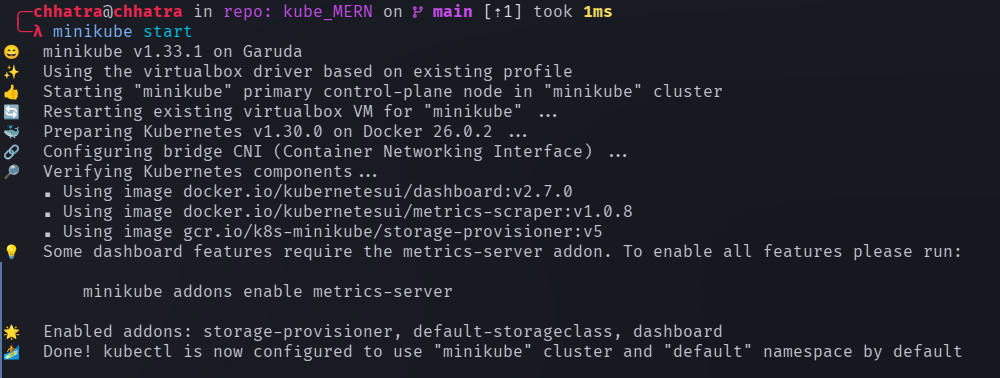
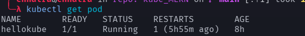
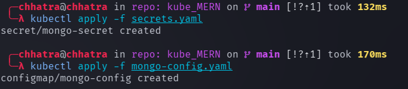
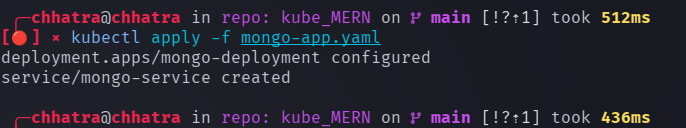
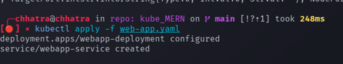
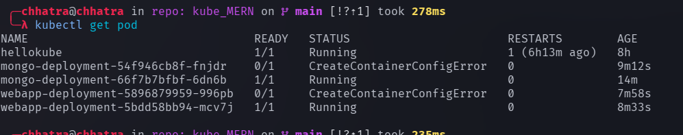

## Running a express js inside k8s

We have defined files like mongo-config.yaml , mongo-app.yaml, secrets.yaml and web-app.yaml

mongo-config.yaml contains neccesary configuration for mongodb-server.

mongo-app.yaml contains neccesary instruction to setup a mongodb inside a container which is management k8s.

secrets.yaml contains the neccessary secrets like password , username etc

web-app.yaml contains the instructions to build a container running mongo-express

Now configuration files are setup follow the instruction below to see it in action.

## Run the following instructions.

```
minicube start
```



```
kubectl get pods
```



Run the following commands  one after other line by line

```
kubectl apply -f secrets.yaml

kubectl apply -f mongo-config.yaml

kubectl apply -f mongo-app.yaml

kubectl apply -f web-app.yaml
```







Now let's see how many pods are running.



Run 
```
minikube service webapp-service 
```

and go to the url and see the website running
